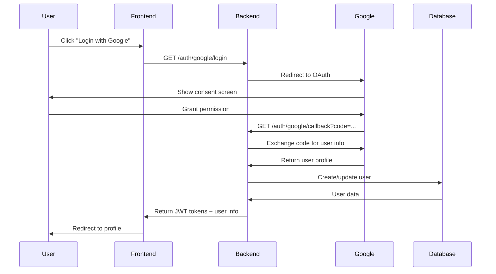

# API Documentation

## Overview

The TreinaVagaAI API provides authentication and user management functionality using Google OAuth 2.0 and JWT tokens.

**Base URL**: `http://localhost:3001` (development)

## Authentication Flow



## Endpoints

### Authentication

#### POST /auth/google/login
Initiates Google OAuth flow.

**Response:**
```json
{
  "url": "https://accounts.google.com/oauth/authorize?client_id=..."
}
```

#### GET /auth/google/callback
Handles Google OAuth callback.

**Query Parameters:**
- `code` (string, required): Authorization code from Google
- `state` (string, optional): Security state parameter

**Success Response (200):**
```json
{
  "access_token": "eyJhbGciOiJIUzI1NiIsInR5cCI6IkpXVCJ9...",
  "refresh_token": "eyJhbGciOiJIUzI1NiIsInR5cCI6IkpXVCJ9...",
  "expires_in": 900,
  "token_type": "Bearer",
  "user": {
    "id": "550e8400-e29b-41d4-a716-446655440000",
    "email": "user@example.com",
    "name": "John Doe",
    "picture": "https://lh3.googleusercontent.com/...",
    "role": "user",
    "createdAt": "2024-01-01T00:00:00.000Z",
    "updatedAt": "2024-01-01T00:00:00.000Z",
    "lastLoginAt": "2024-01-01T00:00:00.000Z"
  }
}
```

**Error Response (400):**
```json
{
  "statusCode": 400,
  "message": "Invalid authorization code",
  "error": "Bad Request",
  "timestamp": "2024-01-01T00:00:00.000Z",
  "path": "/auth/google/callback"
}
```

#### POST /auth/refresh
Refreshes access token using refresh token.

**Request Body:**
```json
{
  "refresh_token": "eyJhbGciOiJIUzI1NiIsInR5cCI6IkpXVCJ9..."
}
```

**Success Response (200):**
```json
{
  "access_token": "eyJhbGciOiJIUzI1NiIsInR5cCI6IkpXVCJ9...",
  "expires_in": 900,
  "token_type": "Bearer"
}
```

**Error Response (401):**
```json
{
  "statusCode": 401,
  "message": "Invalid refresh token",
  "error": "Unauthorized",
  "timestamp": "2024-01-01T00:00:00.000Z",
  "path": "/auth/refresh"
}
```

#### POST /auth/logout
Logs out user and invalidates tokens.

**Headers:**
```
Authorization: Bearer <access_token>
```

**Success Response (200):**
```json
{
  "message": "Logout successful"
}
```

### User Management

#### GET /users/profile
Returns authenticated user's profile.

**Headers:**
```
Authorization: Bearer <access_token>
```

**Success Response (200):**
```json
{
  "id": "550e8400-e29b-41d4-a716-446655440000",
  "email": "user@example.com",
  "name": "John Doe",
  "picture": "https://lh3.googleusercontent.com/...",
  "role": "user",
  "createdAt": "2024-01-01T00:00:00.000Z",
  "updatedAt": "2024-01-01T00:00:00.000Z",
  "lastLoginAt": "2024-01-01T00:00:00.000Z"
}
```

**Error Response (401):**
```json
{
  "statusCode": 401,
  "message": "Unauthorized",
  "error": "Unauthorized",
  "timestamp": "2024-01-01T00:00:00.000Z",
  "path": "/users/profile"
}
```

#### PUT /users/profile
Updates authenticated user's profile.

**Headers:**
```
Authorization: Bearer <access_token>
```

**Request Body:**
```json
{
  "name": "Jane Doe",
  "picture": "https://example.com/new-avatar.jpg"
}
```

**Success Response (200):**
```json
{
  "id": "550e8400-e29b-41d4-a716-446655440000",
  "email": "user@example.com",
  "name": "Jane Doe",
  "picture": "https://example.com/new-avatar.jpg",
  "role": "user",
  "createdAt": "2024-01-01T00:00:00.000Z",
  "updatedAt": "2024-01-01T12:30:00.000Z",
  "lastLoginAt": "2024-01-01T00:00:00.000Z"
}
```

**Validation Error (400):**
```json
{
  "statusCode": 400,
  "message": [
    "name must be a string",
    "name should not be empty"
  ],
  "error": "Bad Request",
  "timestamp": "2024-01-01T00:00:00.000Z",
  "path": "/users/profile"
}
```

## Data Models

### User
```typescript
interface User {
  id: string;                    // UUID
  googleId: string;              // Google user ID
  email: string;                 // User email (from Google)
  name: string;                  // Display name
  picture?: string;              // Profile picture URL
  // role field removed; kept for backward compatibility as optional
  role?: string;
  createdAt: Date;               // Account creation timestamp
  updatedAt: Date;               // Last update timestamp
  lastLoginAt?: Date;            // Last login timestamp
}
```

### JWT Payload
```typescript
interface JWTPayload {
  sub: string;                   // User ID
  email: string;                 // User email
  role: 'user' | 'admin';       // User role
  iat: number;                   // Issued at (timestamp)
  exp: number;                   // Expires at (timestamp)
}
```

### Token Response
```typescript
interface TokenResponse {
  access_token: string;          // JWT access token
  refresh_token?: string;        // JWT refresh token (only on login)
  expires_in: number;            // Token expiration in seconds
  token_type: 'Bearer';          // Token type
  user?: User;                   // User info (only on login)
}
```

## Error Handling

All API endpoints return errors in a standardized format:

```typescript
interface ErrorResponse {
  statusCode: number;            // HTTP status code
  message: string | string[];    // Error message(s)
  error: string;                 // Error type
  timestamp: string;             // ISO timestamp
  path: string;                  // Request path
}
```

### Common HTTP Status Codes

- **200 OK**: Request successful
- **201 Created**: Resource created successfully
- **400 Bad Request**: Invalid request data
- **401 Unauthorized**: Authentication required
- **403 Forbidden**: Insufficient permissions
- **404 Not Found**: Resource not found
- **500 Internal Server Error**: Server error

## Rate Limiting

The API implements rate limiting to prevent abuse:

- **Authentication endpoints**: 5 requests per minute per IP
- **User endpoints**: 100 requests per minute per user
- **General endpoints**: 1000 requests per hour per IP

Rate limit headers are included in responses:
```
X-RateLimit-Limit: 100
X-RateLimit-Remaining: 99
X-RateLimit-Reset: 1640995200
```

## CORS Configuration

The API is configured to accept requests from:
- **Development**: `http://localhost:3000`
- **Production**: Configure `CORS_ORIGIN` environment variable

Allowed methods: `GET`, `POST`, `PUT`, `DELETE`, `OPTIONS`
Allowed headers: `Authorization`, `Content-Type`

## Security

### JWT Tokens
- **Access Token**: Short-lived (15 minutes)
- **Refresh Token**: Long-lived (7 days)
- **Algorithm**: HS256
- **Secret**: Configurable via `JWT_SECRET` environment variable

### Google OAuth
- **Scopes**: `profile`, `email`
- **Redirect URI**: Must be configured in Google Cloud Console
- **Client credentials**: Stored in environment variables

### Best Practices
1. Always use HTTPS in production
2. Store tokens securely (httpOnly cookies recommended)
3. Implement proper CORS configuration
4. Use strong JWT secrets (32+ characters)
5. Regularly rotate secrets
6. Monitor for suspicious activity

## Testing

### Using curl

**Login Flow:**
```bash
# 1. Get Google OAuth URL
curl http://localhost:3001/auth/google/login

# 2. After Google callback, you'll have tokens
# 3. Use access token for authenticated requests
curl -H "Authorization: Bearer YOUR_ACCESS_TOKEN" \
     http://localhost:3001/users/profile
```

**Refresh Token:**
```bash
curl -X POST http://localhost:3001/auth/refresh \
     -H "Content-Type: application/json" \
     -d '{"refresh_token": "YOUR_REFRESH_TOKEN"}'
```

### Using Postman

1. Import the OpenAPI spec from `http://localhost:3001/api/docs-json`
2. Set up environment variables for tokens
3. Use the OAuth 2.0 flow for authentication

### Integration Tests

The backend includes integration tests for all endpoints:

```bash
# Run all tests
pnpm --filter backend test

# Run specific test suite
pnpm --filter backend test auth.controller.spec.ts

# Run with coverage
pnpm --filter backend test:cov
```